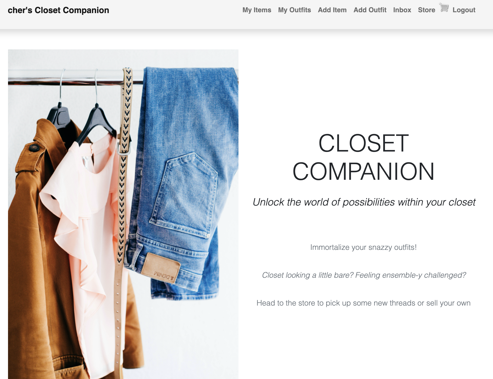
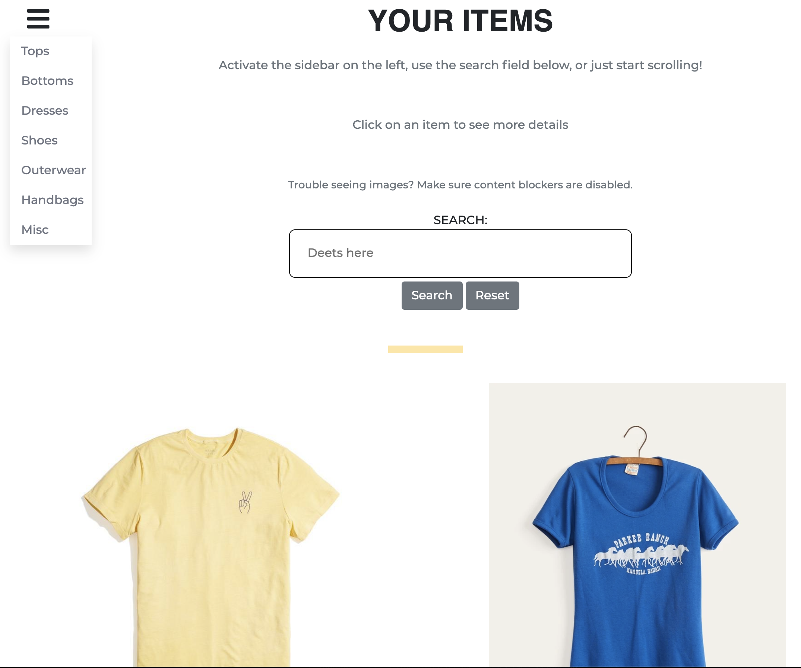
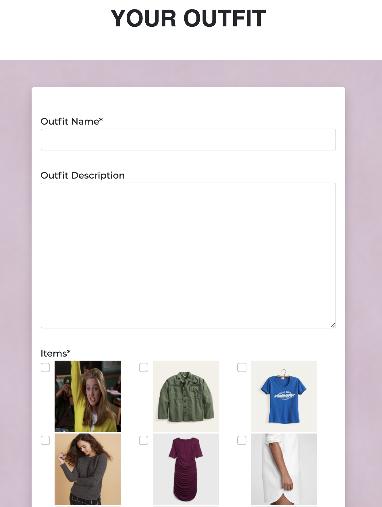

# Closet Companion
Unlock the world of possibilities within your closet





## Technologies Used
- Django
- Python
- Javascript
- PayPal
- Django Crispy Forms
- Bootstrap 5
- AWS for the backend and images
- Heroku for hosting

## User Stories
- As a user, I want to...
- Organize the clothing items in my closet
- Update and delete clothing items
- Assemble outfits
- Create custom tags for my clothes
- Be able to search through my closet 
- Buy and sell items on the companion store
- Send messages to other users

## Code Snippets
I used a single model to generate the six different types of clothes a user can track. 

``` python
class Item(models.Model):
    top = 'top'
    bottom = 'bottom'
    dress = 'dress'
    shoe = 'shoe'
    outerwear = 'outerwear'
    handbag = 'handbag'
    other = 'other'

    item_type = [
        (top, 'top'),
        (bottom, 'bottom'),
        (dress, 'dress'),
        (shoe, 'shoe'),
        (outerwear, 'outerwear'),
        (handbag, 'handbag'),
        (other, 'other'),
    ]

    owner = models.ForeignKey(Profile, null=True, blank=True, on_delete=models.CASCADE)
    name = models.CharField(max_length=100)
    description = models.TextField(max_length=300, blank=True, null=True)
    type = models.CharField(max_length=100, choices = item_type, default=shoe)
    image = ResizedImageField(size=[961, 1140], blank=True, null=True, upload_to="images", default="images/itemdefault.jpg")
    url = models.URLField(max_length=200, blank=True, null=True)
    sell = models.BooleanField(default=False)
    price = models.DecimalField(max_digits=7, decimal_places=2, blank=True, null=True)
    tags = models.ManyToManyField('Tag', blank=True)
    created = models.DateTimeField(auto_now_add=True)
    id = models.UUIDField(default=uuid.uuid4, unique=True, primary_key=True, editable=False)

    def __str__(self):
        return self.name
        
    @property
    def imageURL(self):
        try:
            url = self.image.url
        except:
            url = ''
        return url
```
I then created a search function to allow the user to target specific items, or to bring back everything in that user's closet.
```python
def searchItems(request):
    search_query = ''

    if request.GET.get('search_query'):
        search_query = request.GET.get('search_query')

    tags = Tag.objects.filter(name__icontains=search_query)

    profile = request.user.profile
    items = profile.item_set.all().distinct().filter(
        Q(name__icontains=search_query) | 
        Q(description__icontains=search_query) |
        Q(type__icontains=search_query) |
        Q(tags__in=tags)
    )

    return items, search_query
```

This function is used as follows: 

```python
@login_required(login_url="login")
def items(request):
    items, search_query = searchItems(request)
    tops = items.filter(type='top')
    bottoms = items.filter(type='bottom')
    dresses = items.filter(type='dress')
    shoes = items.filter(type='shoe')
    coats = items.filter(type='outerwear')
    handbags = items.filter(type='handbag')
    others = items.filter(type='other')
    context = {
        'tops': tops, 
        'bottoms': bottoms,
        'dresses': dresses,
        'shoes': shoes,
        'coats': coats,
        'handbags': handbags,
        'others': others,
    }

    return render(request, 'wardrobe/items.html/', context)
```


## The Store
- I built this functionality by starting with a Dennis Ivy YouTube tutorial (https://youtu.be/_ELCMngbM0E) and then extending it to better support what I was looking to do with Clothing Companion. For instance, you can now send messages to other users about their items for sale. The store populates with the items for sale of other users, never your own. After purchase, an item is removed from the seller's closet and therefore from any outfits featuring that item (without breaking the rest of the outfit).

## Reflections
- I learned a ton about Django over the course of building this app. Dennis Ivy's various tutorials were extremely helpful, and the many folks on Stack Overflow--it's good to know that others have conquered the same blockers I ran into over the course of building out this app.
- Landing image from @alexagorn on Unsplash (https://unsplash.com/photos/WF0LSThlRmw)